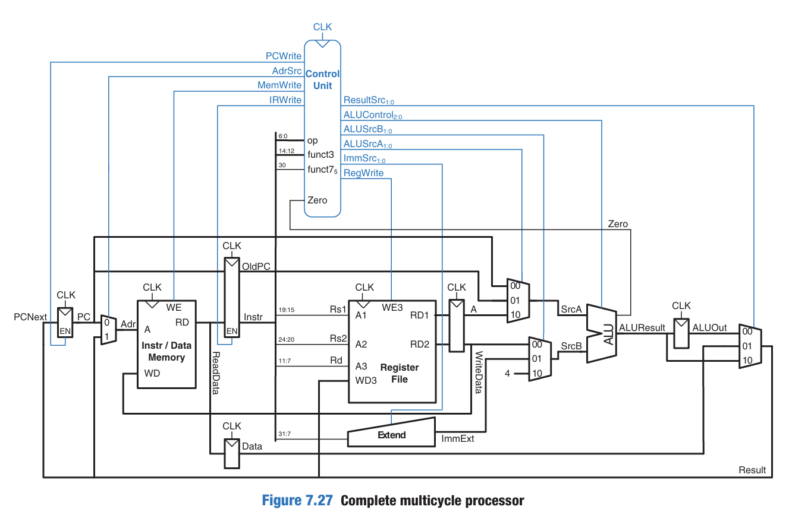
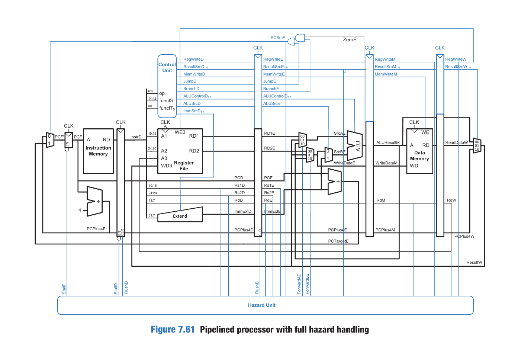

**Description**

This project involves the design and comparison of three different RISC-V microarchitectures: Single-cycle, Multicycle, and Pipelined. The objective is to evaluate the performance, resource usage, and efficiency of each microarchitecture by using the same instruction memory loaded from a memfile.hex. The project includes all necessary Verilog modules.

Single-Cycle Processor

Multipath Processor

Pipelined Processor

This project aims to compare the following metrics across the three microarchitectures:
- **Execution Time**: Time taken for instruction execution in each microarchitecture.
- **Cycle Count**: Number of cycles taken for completing the execution of a program.
- **Resource Usage**: Estimation of resources used by each architecture (e.g., LUTs, flip-flops).
