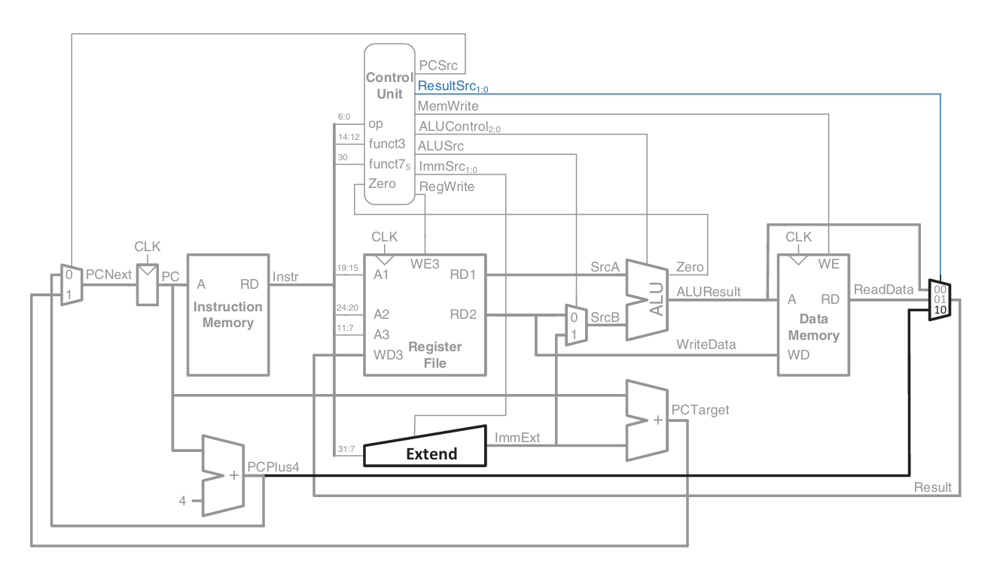

# Single-Cycle RISC-V Processor

## 🧠 Architecture

Implements a basic 32-bit single-cycle RISC-V core where each instruction completes in a single clock cycle.

### Key Features:
- Supports R, I, S, B, U, J formats (basic ALU, load/store, branches)
- All units (ALU, control, registers, memory) used combinationally
- Simple control logic, easy to verify

### Components:
- Instruction Fetch (PC, instruction memory)
- Register File with 2 read ports, 1 write port
- ALU unit
- Immediate Generator
- Control Unit & ALU Control
- Branch decision logic
- Data Memory (for load/store)

## ✅ Status

- Fully tested with sample instruction programs
- Correct PC updates, branch logic, and memory accesses verified
- Simulated using ModelSim/Vivado

## 🖼️ Architecture Diagram

Single-Cycle Processor

## 📌 Notes

- CPI = 1 for all instructions (except memory latency if extended)
- Ideal for learning and debugging simple RISC-V flows
